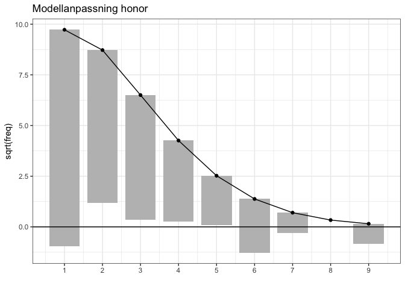
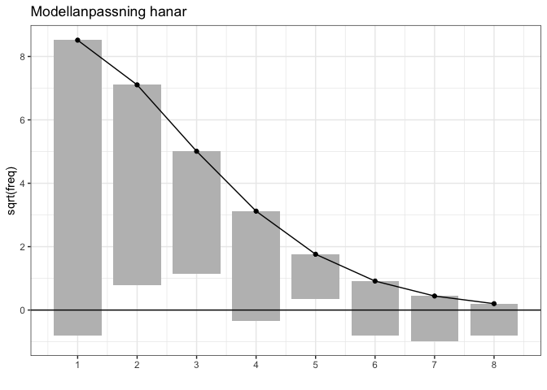

Spillningsinventering björn, Norrbottens län 2021
================

Detta bibliotek innehåller programkod och data som använts för
populationsberäkningar av björn, baserat på spillningsinventeringen i
Norrbottens län 2021. För jämförelsens skull görs även beräkningar för
inventeringarna 2010 och 2016 med samma metodik. Metodiken följer
fångst-återfångstmetoder föreskrivna av skandinaviska björnprojektet.
Koden är skriven i R och anropar programmet MARK genom gränssnittet
RMark. Skriptet `clean_data.R` sammanställer data baserat på underlag
från RovBase (ej inkluderat då det innehåller personuppgifter),
`functions_gh.R` innehåller funktioner för modellanpassning.

Utöver den av björnprojektet föreslagna populationsberäkningen redovisas
även en separat uppskattning av populationstätheten i länet.

## Kort beskrivning av anpassade modeller

Eftersom ansträngningen var tydligt ojämn över inventeringsperioden
undersöker vi endast modeller där fångstsannolikheten varierar med
tidsperiod (kalendervecka). En sammanfattning av resultatet ges i
nedanstående tabeller. I tabellen namnges modellerna enligt den notation
som används av RMark. Modellernas parametrar kan indelas i tre grupper
`pi`, `p` och `f0`. Här anger `f0` storleken hos den del av populationen
som fångats 0 gånger. Notationen `f0(sex)` i samtliga modeller betyder
att denna delats upp i separata parametrar för honor och hanar vilket är
nödvändigt för att få separata populationsskattningar. Vidare bestämmer
parametrarna `p` fångstsannolikheter, här anger `time` att en separat
parameter skattas för varje kalendervecka, `sex` att det finns en
(additiv) könseffekt och `mixture` att populationen delas in i två
klasser (“lättfångad” och en “svårfångad”) för att kompensera för
individuell heterogenitet i fångstsannolikhet. Gruppen `pi` förekommer
endast i modeller med `mixture` (modeller av typ *M<sub>th2</sub>*) och
anger då hur stor andel av populationen som är svår respektive
lättfångad, `p(1)` innebär att denna är samma för båda kön medan
`p(sex)` innebär att andelen kan vara olika för könsgrupperna.

## Resultat

``` r
library(tidyverse)
library(RMark)
source("functions_gh.R")
data <- read_csv("data_BD.csv")
```

``` r
all_fits <- data %>% nest_by(year) %>% 
  mutate(fit = list(fit_models(data))) %>% 
  unnest(fit) %>% ungroup()
best_fits <- filter(all_fits, dAICc == 0)

tabell1 <- all_fits %>% 
  filter(year == 2021) %>% 
  select(Modell = model, dAICc, Hanar = nm,  Honor = nf) 
```

*Tabell 1: Populationsskattningar för undersökta modeller baserat på
inventeringen i Norrbottens län 2021. Modellerna är rangordnade efter
Akaikes informationskriterium med den högst rankade modellen överst.*

| Modell                          | dAICc | Hanar | Honor |
|:--------------------------------|------:|------:|------:|
| pi(1)p(time + mixture)f0(sex)   |   0.0 |   219 |   325 |
| pi(sex)p(time + mixture)f0(sex) |   1.4 |   223 |   326 |
| p(time + sex)f0(sex)            | 101.4 |   194 |   275 |
| p(time)f0(sex)                  | 101.4 |   188 |   279 |

``` r
tabell2 <- best_fits %>% 
  mutate(Hanar = paste(nm, pretty_ci(nm_l, nm_u)),
         Honor = paste(nf, pretty_ci(nf_l, nf_u))) %>% 
  select(Inventeringsår = year, Hanar, Honor, Modell = model)
```

*Tabell 2: Populationsskattningar med 95% konfidensintervall för de tre
inventeringsåren 2010, 2016 och 2021 baserat på modell med lägst dAIC
(samma modell för alla).*

| Inventeringsår | Hanar          | Honor          | Modell                        |
|---------------:|:---------------|:---------------|:------------------------------|
|           2010 | 211 (187, 251) | 314 (280, 370) | pi(1)p(time + mixture)f0(sex) |
|           2016 | 160 (147, 181) | 252 (234, 282) | pi(1)p(time + mixture)f0(sex) |
|           2021 | 219 (198, 253) | 325 (296, 371) | pi(1)p(time + mixture)f0(sex) |

# Täthetskartor

Vid bestämning av populationstäthet definierar vi de fångade
individernas *position* som medelpunkten av positionen för funna
spillningar, vilket kan tolkas som ett centrum för individens aktivitet.
Detta ger troligtvis en mer rättvisande bild för honor än hanar, då
honor är mer trogna sina hemområden. För att kunna bestämma
populationstäthet givet de fångade individernas position behöver vi
först uppskatta sannolikheten att en individ upptäcks under
inventeringen och hur denna varierar geografiskt. Under antagandet att
antalet kalenderveckor en individ upptäcks följer en Poisson-fördelning
med medelvärde `mu(x, y)`, där `(x, y)` är individens position, kan
denna sannolikhet då beräknas som `p(x, y)=1 - exp(-mu(x, y))`. Om
tätheten för fångade individer betecknas `lambda(x, y)` kan sedan
populationstätheten bestämmas som `lambda(x, y)/p(x, y)`.

## Skattning av `mu` och `lambda`

Funktionerna `mu(x, y)` och `lambda(x, y)` uppskattas med så kallade
GAM-modeller implementerade i R-paketet `mgcv`. För skattning av
`mu(x, y)` används en noll-trunkerad Poisson-fördelning
(`countreg::ztpoisson`) eftersom vi inte har positioner för individer
som hittas noll gånger. För skattning av `lambda(x, y)` delas länet in i
rutor om en kvadratmil varefter en Poissonfördelning med medelvärde
`lambda(x, y)` anpassas till antalet fångade individer i varje ruta (här
betecknar `(x, y)` rutans mittpunkt).

``` r
grid_counts <- read_csv("grid_counts.csv") # calculated in clean_data.R

fit_females <- fit_spatial_2021(data = data %>% filter(sex == "Hona", year == 2021),
                                grid = grid_counts %>% filter(sex == "Hona", year == 2021))

fit_males <- fit_spatial_2021(data = data %>% filter(sex == "Hane", year == 2021),
                                grid = grid_counts %>% filter(sex == "Hane", year == 2021))
```

Genom att visualisera `p(x, y)` får vi en uppfattning om hur jämn
insamlingen varit över länet. Notera att uppskattningen i områden med få
individer är mycket osäker.

``` r
plot_spatial(fit_females, p) + ggtitle("Fångstsannolikhet honor")
```


*Figur 1: Uppskattad sannolikhet att en hona hittas en eller flera
gånger under inventeringen givet position. Punkter markerar funna
individer som använts vid skattningen.*

``` r
plot_spatial(fit_males, p) + ggtitle("Fångstsannolikhet hanar")
```


*Figur 2: Uppskattad sannolikhet att en hane hittas en eller flera
gånger under inventeringen givet position. Punkter markerar funna
individer som använts vid skattningen.*

Här är det tydligt att individer i länets nordvästra fjälltrakter har
lägre sannolikhet att upptäckas. Hanar verkar även ha något lägre
sannolikhet att upptäckas än honor. Slutligen visualiserar vi
populationstätheten.

``` r
plot_spatial(fit_females, lambda) + ggtitle("Populationstäthet honor")
```


*Figur 3: Uppskattad populationstäthet honor (aktivitetscentra per
kvadratmil). Punkter markerar funna individer som använts vid
skattningen.*

``` r
plot_spatial(fit_males, lambda) + ggtitle("Populationstäthet hanar")
```


*Figur 4: Uppskattad populationstäthet hanar (aktivitetscentra per
kvadratmil). Punkter markerar funna individer som använts vid
skattningen.*

## Modellvalidering populationstätheter

Ovan populationstätheter är bestämda under antagandet att antalet
fångstveckor per individ följer en Poisson-fördelning vars medelvärde
endast beror på individens position och kön. Andra typer av individuell
variation antas vara försumbara. Detta kan verifieras grafiskt genom ett
så kallat rotogram (se tex [Kleiber & Zeilis
(2006)](https://arxiv.org/pdf/1605.01311.pdf)) som jämför empiriska
frekvenser med vad som kan förväntas från den anpassade modellen. I
Figur 5 och 6 visas rotogram motsvarande anpassningen för honor och
hanar. I en perfekt anpassning når de hängande staplarna precis till 0,
här ser vi framför allt en något större frekvens än förväntat av
individer som hittats en gång samt fler än fem gånger vilket indikerar
en viss överspridning relativt Poissonfördelningen. En trolig effekt av
detta är att de uppskattade fångstsannolikheterna är något optimistiska
och populationstätheterna således underskattade.

``` r
rootogram_ztp(fit_females$effort_fit) + ggtitle("Modellanpassning honor")
```

<!-- -->

*Figur 5: Rotogram illustrerande skillnaden mellan observerade och
förväntade antal fångstveckor per individ för honor.*

``` r
rootogram_ztp(fit_males$effort_fit)+ ggtitle("Modellanpassning hanar")
```

<!-- -->

*Figur 6: Rotogram illustrerande skillnaden mellan observerade och
förväntade antal fångstveckor per individ för hanar.*
